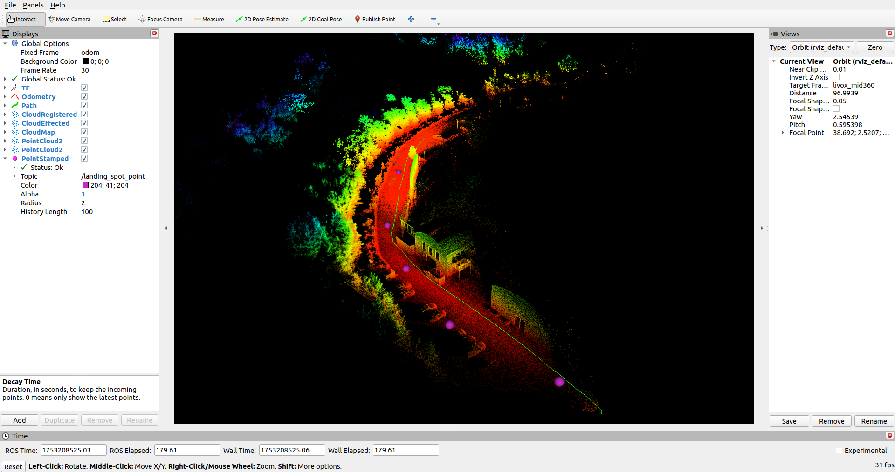

# FireDragon Docker Robotics System

This project provides a complete robotics system (LiDAR driver, drone landing spot detection, and more) in a ready-to-use Docker container.

---

## 🚀 1. Pull the Docker Image

```bash
docker pull ghcr.io/teknologisk-institut/firedragon:v1.3.0
```
This downloads the FireDragon image to your computer.

---

## 🚦 2. Running the Container

**Basic Example (with no special options):**

```bash
docker run --rm -it --network=host --ipc=host --pid=host \
    -e BROADCAST_CODE=YOURCODE \
    -e MAVLINK_URL=tcp:127.0.0.1:5760 \
    -e RVIZ=false \
    -e DISABLE_LOGS=false \
    -e DISPLAY=$DISPLAY \
    -v /tmp/.X11-unix:/tmp/.X11-unix \
    ghcr.io/teknologisk-institut/firedragon:v1.3.0
```

---

## 🖥️ 3. Enabling GUI Apps (RViz, etc.)

If you want to use RViz or other graphical tools inside the container, you must allow the container (which runs as `root`) to access your X server.  
**Do this once each session (in a terminal on your host):**

```bash
xhost +local:root
```

**Then** you can start the container as usual (with GUI support):

```bash
docker run --rm -it --network=host --ipc=host --pid=host \
    -e BROADCAST_CODE=YOURCODE \
    -e MAVLINK_URL=tcp:127.0.0.1:5760 \
    -e RVIZ=false \
    -e DISABLE_LOGS=false \
    -e DISPLAY=$DISPLAY \
    -v /tmp/.X11-unix:/tmp/.X11-unix \
    ghcr.io/teknologisk-institut/firedragon:v1.3.0
```

---

### **Why is this needed?**

- By default, your Linux X11 server blocks programs running as a different user (like root in Docker).
- `xhost +local:root` allows local `root` processes (like Docker containers) to display GUIs on your desktop.

---

### **To remove access after use (for security):**

You can remove that permission with:

```bash
xhost -local:root
```

---

## 🔧 4. Environment Variables Explained

You control how FireDragon runs using these **environment variables** (the `-e NAME=value` options):

| Variable        | What it does                                                                           | Typical value                                              |
|-----------------|---------------------------------------------------------------------------------------|------------------------------------------------------------|
| `BROADCAST_CODE`| Tells the LiDAR driver which specific LiDAR device to connect to.                      | The code printed on your LiDAR sensor’s label,<br> e.g. `0T9DFBC00402711` |
| `MAVLINK_URL`   | Sets how the system connects to your drone’s autopilot (MAVLink interface).            | TCP: `tcp:127.0.0.1:5760` <br> Serial: `serial:/dev/ttyUSB0:921600` <br> UDP: `udp:14550`|
| `RVIZ`          | If `true`, opens a 3D visualization GUI called RViz. If `false`, RViz is not started.  | `true` or `false`                                          |
| `DISABLE_LOGS`  | If `true`, disables info/debug logs (less console output). If `false`, normal output.  | `true` or `false`                                          |

---

### **How to Use**

- **Set your LiDAR's broadcast code:**  
  Find the code on the LiDAR hardware label.  
  Example:  
  ```bash
  -e BROADCAST_CODE=0T9DFBC00402711
  ```

- **Set MAVLink connection:**  
  For companion computers (like Raspberry Pi with autopilot), you'll often use something like:  
  ```bash
  -e MAVLINK_URL=tcp:127.0.0.1:5760
  ```
  Or for serial connection:  
  ```bash
  -e MAVLINK_URL=serial:/dev/ttyUSB0:921600
  ```

- **Open RViz GUI:**  
  ```
  -e RVIZ=true
  ```
  _(Requires Linux X11. On Windows/Mac or headless Linux, usually leave as `false`.)_

- **Quiet mode (fewer logs):**  
  ```
  -e DISABLE_LOGS=true
  ```

---

## 🖥️ 5. Expected Output

After starting the FireDragon Docker container, here’s what you should see if everything is working:

---

### **LiDAR Data Mapping in RViz**

If you started the container with `-e RVIZ=true`, a window like this will appear:



**In RViz you will:**
- See the live mapped LiDAR point cloud from your sensor.
- Optionally, add markers for detected drone landing spots.
- To view the landing spots:
  1. Click the **Add** button in the bottom left of RViz.
  2. In the dialog, select **By Topic** tab.
  3. Find and select `/landing_spot_point` (it publishes the suggested landing spots).
  4. The landing spots will appear as colored spheres in the point cloud.

---

### **Landing Spot GPS in Mission Planner**

If you have set `MAVLINK_URL` correctly and are running **Mission Planner** (or any GCS that shows MAVLink STATUSTEXT), you will see messages with GPS coordinates for detected landing spots:


- Example message:  
  `Landing: 55.369270, 10.411883, 18.9`
- These messages appear in the **Messages** tab in Mission Planner (red box).
- The red arrow on the map shows the drone, and the right-side panel shows the live coordinates sent by FireDragon.

---

## ✅ What should happen

- **RViz** will display the mapped environment as a colored point cloud, plus visible landing spot markers if you added the topic.
- **Mission Planner** will display landing spot coordinates in the Messages tab when new candidates are found by the algorithm.

---

## 📝 **Example Commands**

### Start normally (logs on, no GUI):
```bash
docker run --rm -it --network=host --ipc=host --pid=host \
    -e BROADCAST_CODE=0T9DFBC00401611 \
    -e MAVLINK_URL=tcp:127.0.0.1:5760 \
    -e RVIZ=false \
    -e DISABLE_LOGS=false \
    ghcr.io/teknologisk-institut/firedragon:v1.3.0
```

### Start with RViz GUI (Linux X11 required):
```bash
docker run --rm -it --network=host --ipc=host --pid=host \
    -e BROADCAST_CODE=YOUR_CODE \
    -e MAVLINK_URL=serial:/dev/ttyUSB0:921600 \
    -e RVIZ=true \
    -e DISPLAY=$DISPLAY \
    -v /tmp/.X11-unix:/tmp/.X11-unix \
    ghcr.io/teknologisk-institut/firedragon:v1.3.0
```

### Start in quiet mode:
```bash
docker run --rm -it --network=host --ipc=host --pid=host \
    -e BROADCAST_CODE=YOUR_CODE \
    -e MAVLINK_URL=udp:14550 \
    -e DISABLE_LOGS=true \
    ghcr.io/teknologisk-institut/firedragon:v1.3.0
```

---

## Need Help?

- **LiDAR not detected?** Double-check your `BROADCAST_CODE`.
- **No MAVLink connection?** Make sure the `MAVLINK_URL` matches your system setup.
- **RViz doesn't display?** Make sure you're running Linux with X11, and your Docker has access to your display.

---
